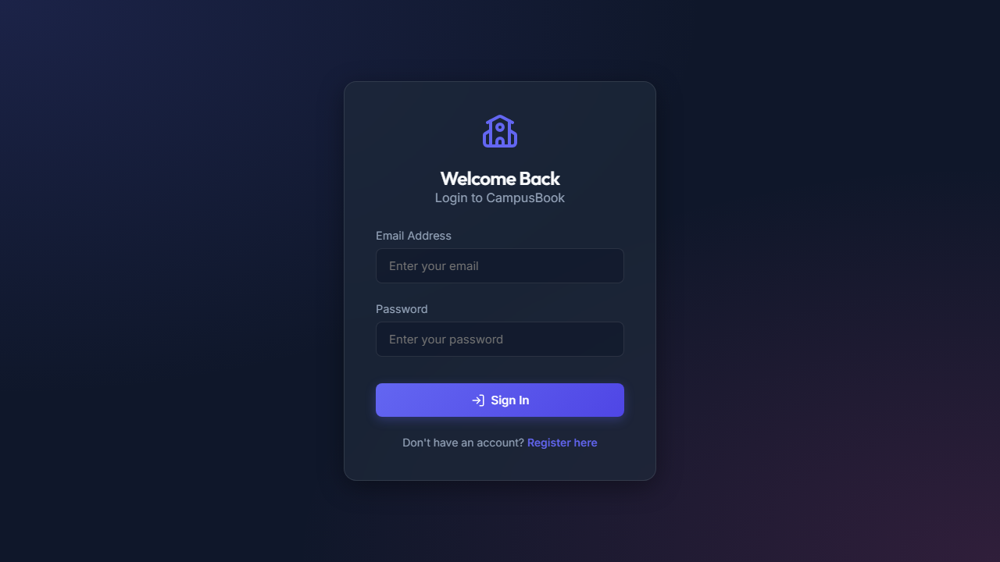
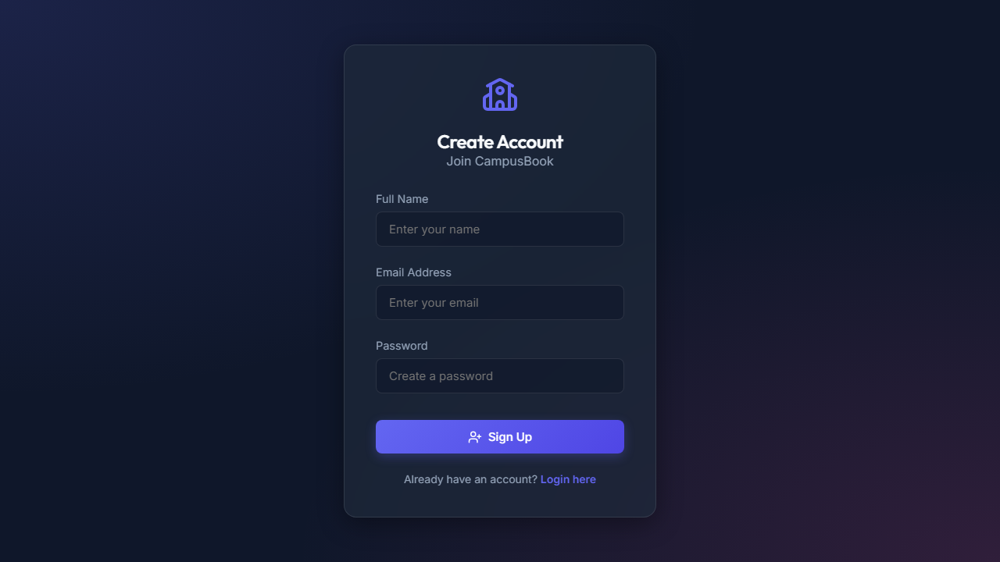
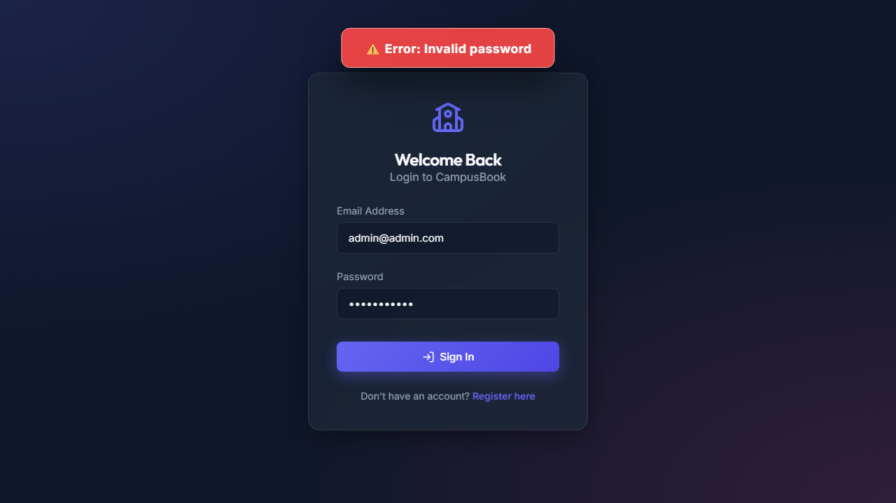
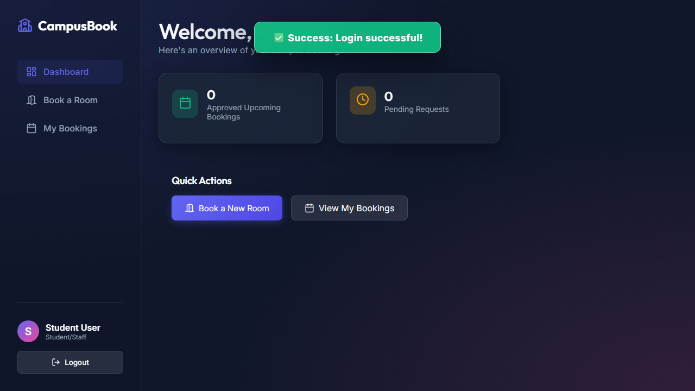

# Campus Booking System
Modernize Room and Facility Booking on Campus
*An intuitive and elegant solution for managing campus spaces.*

---

# Introduction & Overview
The Campus Booking System is a centralized, responsive web application designed to simplify and streamline the reservation of campus facilities. 

**Core Objectives:**
- **Eliminate** scheduling conflicts
- **Provide** real-time availability of rooms
- **Deliver** a premium, user-friendly interface with glassmorphism design elements

---

# Features Available
- **Real-Time Booking:** Browse and book rooms dynamically.
- **Role-Based Access Control:** Distinct interfaces and privileges for Admins and Students/Staff.
- **Smart Validation:** Prevents invalid durations and respects facility operating hours.
- **Responsive Design:** Stunning UI featuring glassmorphism and micro-animations.
- **Secure Authentication:** JWT-based secure login and registration system.

---

# Authentication & Access (Login)
The platform provides a secure entry point for all users, distinguishing between standard users and administrators automatically.

---

# User Registration
New users can easily sign up and create a profile. Special admin privileges are assigned based on specific criteria.

---

# Functions of Admin
Administrators have full oversight and control over the campus facilities and booking requests.

**Key Responsibilities:**
- **Manage Facilities:** Add, update, or remove campus rooms and facilities.
- **Monitor Usage:** View an overview of system utilization and room occupancy.
- **Process Requests:** Approve, reject, or cancel pending booking requests.
- **Filter & Search:** Functional filtering to easily manage various booking statuses.

---

# Admin Dashboard
A centralized hub for administrators to monitor pending requests and system statistics.

---

# Admin Room Management
Admins can easily maintain the directory of available rooms, updating capacity, type, and availability.

---

# Functions of Student & Staff
Standard users can easily find and reserve the spaces they need for their academic and extracurricular activities.

**Key Capabilities:**
- **Search Rooms:** Filter rooms by capacity, type, and availability.
- **Book Facilities:** Select dates and times to reserve a room effortlessly.
- **Modify Bookings:** Update or cancel existing reservations.
- **Track Status:** View the real-time approval status of past and upcoming bookings.

---

# Student / Staff Dashboard
A personalized view showing upcoming bookings, past history, and quick access to new reservations.

---

# System Testing
Ensuring reliability, security, and correctness across the entire platform.

**Unit Testing:**
- Individual components (e.g., date-time validators, authentication helpers) are tested in isolation.
- Ensures backend API validations and frontend UI elements behave correctly under edge cases.

**Integration Testing:**
- Tests the interaction between the React frontend, Node/Express backend, and MongoDB database.
- Verifies complete end-to-end workflows, such as the full room booking lifecycle and admin approval processes.

---

# Conclusion
The Campus Booking System provides a seamless, efficient, and visually stunning experience for managing campus facility reservations.

**Empowering users with control and administrators with insight.**
